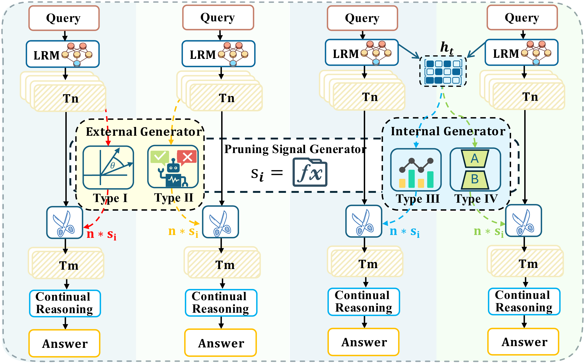
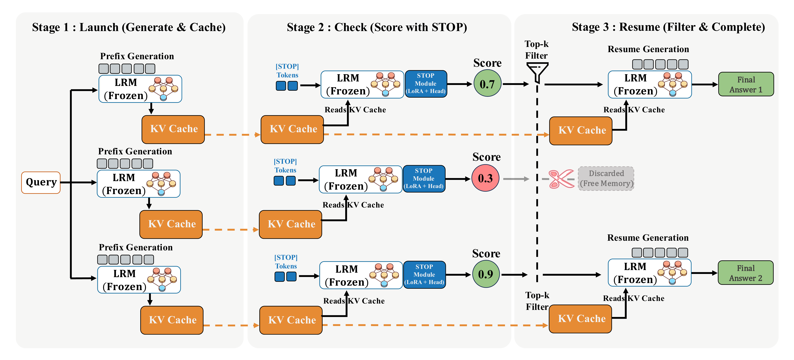
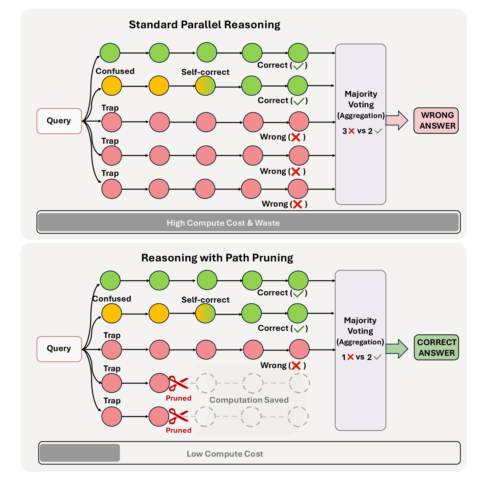

<div align="center">
  
</div>

# STOP: Cut Your Losses! Learning to Prune Paths Early for Efficient Parallel Reasoning

Official implementation for **"Cut Your Losses! Learning to Prune Paths Early for Efficient Parallel Reasoning"**.
<p align="center">
<a href="https://github.com/bijiaxihh/STOP/blob/main/LICENSE">
</a>

<!-- <a href="https://arxiv.org/abs/2505.07787" target="_blank">
</a> -->
<a href="https://huggingface.co/Learning-from-Peers" target="_blank">
</a>
</p>

<p align="center">
<!-- <a href="https://bijiaxihh.github.io/STOP/" target="_blank">🌐 Project Page</a> • -->
<a href="https://github.com/bijiaxihh/STOP/tree/main target="_blank">💻 Code</a> •
<!-- <a href="https://arxiv.org/abs/2505.07787" target="_blank">📃 Paper</a> • -->
<a href="https://huggingface.co/Learning-from-Peers" target="_blank">🤗 Datasets & Models</a>
</p>

## Overview

Parallel reasoning improves the performance of Large Reasoning Models (LRMs), but it is also expensive: many sampled paths are already unpromising from their early prefixes and still consume the full decoding budget. STOP addresses this problem with a lightweight internal pruning module that reads prefix KV-cache states, predicts whether a path is promising, and resumes only the most valuable candidates.

## Abstract

Parallel reasoning enhances Large Reasoning Models (LRMs) but incurs prohibitive costs due to futile paths caused by early errors. To mitigate this, path pruning at the prefix level is essential, yet existing research remains fragmented without a standardized framework. We propose the first systematic taxonomy of path pruning, categorizing methods by their signal source and learnability. This reveals the unexplored potential of **learnable internal pruning**, which we instantiate with **STOP** (Super TOken for Pruning). Extensive evaluations across LRMs ranging from 1.5B to 20B parameters demonstrate that STOP improves both effectiveness and efficiency. We further validate its scalability under varying compute budgets and distill these observations into empirical deployment guidelines.

## Key Features

* **First systematic taxonomy of path pruning**: We organize prior methods by signal source and learnability.
* **Type IV pruning**: STOP is the first instantiation of the learnable internal pruning paradigm.
* **Early path pruning**: STOP identifies low-value trajectories from their prefixes instead of waiting for full completion.
* **Internal and lightweight**: STOP works directly on cached internal states, avoiding expensive prefix recomputation.
* **Strong effectiveness and efficiency**: STOP improves reasoning quality while reducing token usage by over **70%** in many settings.
* **Practical deployment guideline**: STOP provides an empirical rule for choosing retention ratios under different compute budgets.

## A Unified View of Path Pruning

We organize existing path pruning methods by two axes: the source of the pruning signal (**internal vs. external**) and whether the signal generator is **learnable vs. non-learnable**. This taxonomy highlights the missing but desirable quadrant of **learnable internal pruning**, which STOP instantiates as a Type IV method.

<p align="center">
  
</p>

## STOP Framework

STOP follows a simple three-stage pipeline:

1. **Launch**: generate short reasoning prefixes and cache their internal states.
2. **Check**: append a special token and score each prefix with a lightweight classifier.
3. **Resume**: keep only the most promising candidates and continue generation.

Because STOP reuses the KV cache, it avoids re-encoding the full prefix and adds only a small amount of extra overhead.

<p align="center">
  
</p>

## Why Prune Early?

In standard parallel reasoning, every sampled path is usually generated to completion and then aggregated. However, many paths fail because of mistakes made very early in the reasoning process. Continuing these trajectories wastes compute and can even hurt the final answer when poor paths are mixed into aggregation.

<p align="center">
  
</p>

## Repository Structure

```text
.
├── STOP/
│   ├── src/
│   │   ├── finetuning_harmony.py
│   │   ├── inference.py
│   │   └── evaluate_harmony_vllm.py
│   ├── scripts/
│   │   └── run_train-harmony.sh
│   ├── Prefix-Generation./
│   └── vllm/
├── data/
│   └── benchmark/
├── figures/
├── index.html
├── requirements.txt
└── README.md
```

## Getting Started

Install the core Python dependencies:

```bash
pip install -r requirements.txt
```

This project uses a **modified local vLLM source tree** instead of a plain PyPI `vllm` package. You should unpack and build the local `STOP/vllm` source according to your environment before running the code.

You will also need to prepare your own:

* base model weights
* tokenizer files
* STOP checkpoints
* local runtime assets under the paths expected by the scripts

For empirical results and figures, please refer to the [project page](./index.html).

## Training

The main training code is:

```bash
python STOP/src/finetuning_harmony.py --help
```

The recommended launcher is:

```bash
bash STOP/scripts/run_train-harmony.sh
```

The actual training entrypoint is:

* `STOP/src/finetuning_harmony.py`
* `STOP/scripts/run_train-harmony.sh`

The training code learns a lightweight classifier on top of a frozen base model using LoRA adapters and a classifier head to score reasoning prefixes.

## Inference

The main inference entrypoint is:

```bash
python STOP/src/inference.py
```

The actual inference code is:

* `STOP/src/inference.py`

This script expects local runtime assets such as model weights, tokenizer assets, tiktoken encodings, and classifier checkpoints.

